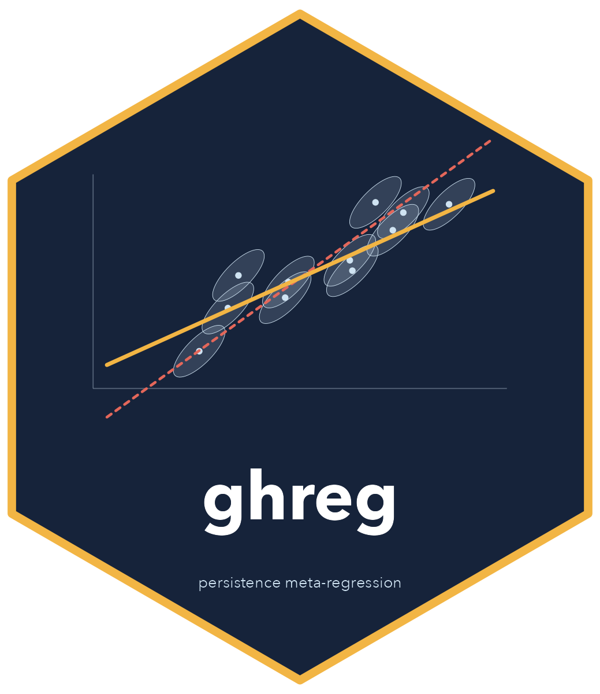
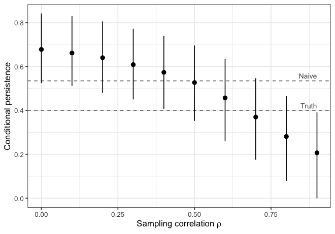

# ghreg 

<!-- badges: start -->
[](https://github.com/joshgilbert1994/ghreg/actions/workflows/R-CMD-check.yaml)
[](https://joshgilbert1994.github.io/ghreg/)
<!-- badges: end -->

Meta-analyses often measure how well intervention effects persist by regressing follow-up effect sizes on endline effect sizes. Both effect sizes come from the same participants and outcomes, so their sampling errors are correlated, and the naive slope usually **overstates** persistence.

ghreg fits the Bayesian meta-regression of [Gilbert and Himmelsbach (2026)](https://doi.org/10.26300/87r9-qm15). The model accounts for sampling error in both effect sizes and for the correlation between them, and it supports the sensitivity analysis the paper recommends when that correlation is unknown.

## Installation

```r
# install.packages("remotes")
remotes::install_github("joshgilbert1994/ghreg", build_vignettes = TRUE)
```

Models are fit in [Stan](https://mc-stan.org). ghreg works with [rstan](https://mc-stan.org/rstan/) out of the box. If [cmdstanr](https://mc-stan.org/cmdstanr/) and CmdStan are installed, ghreg uses them instead. The model compiles once per machine; after that, fits take a few seconds.

## Example

`persist_sim` is a simulated meta-analysis of 174 pairs of effect sizes from 60 studies, with a true conditional persistence of 0.4. The naive slope is 0.54:

```r
library(ghreg)
coef(lm(es2 ~ es1, data = persist_sim))["es1"]
#>       es1 
#> 0.5350661
```

`gh_reg()` corrects for the correlated sampling error. `rho` is the sampling correlation: one number, or a column with one value per pair.

```r
fit <- gh_reg(persist_sim, es1, se1, es2, se2, study = study, rho = rho)
fit
#> Gilbert-Himmelsbach persistence meta-regression
#> 3-level model: 174 pairs of effect sizes in 60 studies
#> Sampling correlation (rho): varies, 0.23 to 0.94 (mean 0.67)
#> Backend: cmdstanr, 4 chains x 1000 draws; 0 divergent transitions
#> 
#> # A tibble: 7 × 8
#>   term      estimate std.error ci.lower ci.upper  rhat ess_bulk ess_tail
#>   <chr>        <dbl>     <dbl>    <dbl>    <dbl> <dbl>    <dbl>    <dbl>
#> 1 beta        0.334     0.0908  0.149      0.503  1.00    1220.    1624.
#> 2 alpha       0.0139    0.0433 -0.0672     0.103  1.00    1266.    1752.
#> 3 mu          0.444     0.0268  0.391      0.496  1.00    3036.    2288.
#> 4 study_sd1   0.139     0.0290  0.0815     0.196  1.00    3042.    1628.
#> 5 study_sd2   0.0621    0.0221  0.0106     0.104  1.01    1209.     552.
#> 6 es_sd1      0.161     0.0241  0.116      0.210  1.00    2106.    2258.
#> 7 es_sd2      0.0580    0.0251  0.00359    0.104  1.00     943.     468.
```

The summary is a tibble (`fit$summary`) with broom-style column names. `summary()` recomputes it at another interval level:

```r
summary(fit, ci.level = 0.9, diagnostics = FALSE)
#> # A tibble: 7 × 5
#>   term      estimate std.error ci.lower ci.upper
#>   <chr>        <dbl>     <dbl>    <dbl>    <dbl>
#> 1 beta        0.334     0.0908   0.183    0.478 
#> 2 alpha       0.0139    0.0433  -0.0547   0.0852
#> 3 mu          0.444     0.0268   0.399    0.488 
#> 4 study_sd1   0.139     0.0290   0.0922   0.187 
#> 5 study_sd2   0.0621    0.0221   0.0218   0.0965
#> 6 es_sd1      0.161     0.0241   0.123    0.201 
#> 7 es_sd2      0.0580    0.0251   0.0110   0.0964
```

The correlation of outcomes across time is rarely reported, so the paper treats it as a sensitivity parameter. `gh_sensitivity()` refits over a grid of values and returns the results as a tibble:

```r
sens <- gh_sensitivity(persist_sim, es1, se1, es2, se2, study = study,
                       rho = seq(0, 0.9, by = 0.1))
plot(sens, ref = c(Naive = 0.535, Truth = 0.4))
```



See the [Get started guide](https://joshgilbert1994.github.io/ghreg/articles/ghreg.html) (also available as `vignette("ghreg")`) for the details, and the [package website](https://joshgilbert1994.github.io/ghreg/) for all the help pages.

## Functions

| Function | Purpose |
|---|---|
| `gh_reg()` | Fit the model for a given sampling correlation |
| `gh_sensitivity()` | Refit over a range of sampling correlations |
| `gh_prior()` | Set priors (defaults are the paper's) |
| `gh_simulate()` | Simulate meta-analytic data from trials with correlated outcomes |
| `gh_backend()` | Report or choose the Stan backend |

## Citation

If you use ghreg, please cite the paper:

> Gilbert, J. B., & Himmelsbach, Z. (2026). *Why fadeout is (probably) worse than we think: Adjusting for correlated sampling error in meta-analyses of behavioral interventions* (EdWorkingPaper No. 26-1394). Annenberg Institute at Brown University. https://doi.org/10.26300/87r9-qm15

`citation("ghreg")` gives a BibTeX entry.
